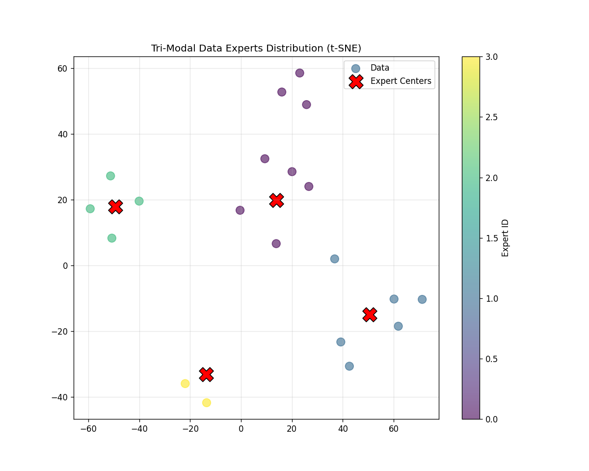

# Tri-MoDE: Scalable Tri-Modal Data Experts via Unified Embedding Alignment



## Introduction
**Tri-MoDE** is a lightweight, scalable unsupervised clustering framework designed for **Tri-Modal (Image + Text + Audio)** data. 

Unlike traditional methods that require heavy GPU resources, Tri-MoDE implements a **CPU-efficient pipeline** capable of routing large-scale multimodal data into specialized "Data Experts" through unified embedding alignment.

## Key Features
- **Tri-Modal Fusion**: Unifies vision (CLIP), text (SimCSE/CLIP), and audio (CLAP) into a 1536-dim shared semantic space.
- **Scalable Architecture**: Built on **WebDataset** streaming and **Mini-Batch K-Means**, supporting out-of-core processing for large-scale datasets.
- **Resource Efficient**: Optimized for CPU environments with solved multiprocessing deadlocks on Windows.
- **Visual Interpretability**: Includes t-SNE visualization to verify semantic alignment and expert routing.

## Installation

1. Clone the repository:
   ```bash
   git clone [https://github.com/YOUR_USERNAME/Tri-MoDE.git](https://github.com/YOUR_USERNAME/Tri-MoDE.git)
   cd Tri-MoDE
2. Install dependencies:
   ```bash
   pip install -r requirements.txt
    
## Usage Pipeline
1. Data Preparation (ESC-50)
   ```bash
   python scripts/step1_download.py
2. Standardization (WebDataset)
   ```bash
   python scripts/step2_pack.py
3. Feature Extraction (CLIP + CLAP)
   ```bash
   python src/prep_feature_tri.py
4. Train Experts (Clustering)
   ```bash
   python scripts/step3_train.py
5. Routing & Visualization
   ```bash
   python scripts/step4_assign.py
   
## Performance (Scalability Test)
Tested on simulated 100k samples with 64 experts:
- **Throughput**: ~30,000 samples/sec (CPU)
- **Memory**: Constant complexity (Mini-Batch)

## License
MIT License
   